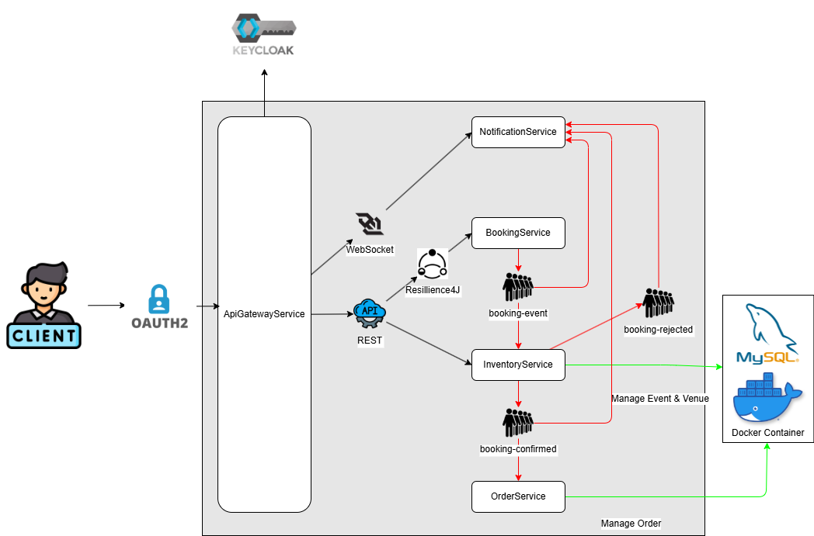

# 📦 Microservice - Inventory Service

The **Inventory Service** is a core component of the microservice architecture.  
It manages **event and venue inventory data**, handles persistence via **MySQL**, communicates asynchronously through **Kafka**, and provides **REST APIs** documented with **OpenAPI**.

---

## 🚀 Overview

This service is responsible for maintaining inventory availability and consistency within the system.  
It exposes REST endpoints to retrieve and manage inventory information and publishes/consumes events via Kafka for inter-service communication (e.g., bookings, updates).

---

## ⚙️ Key Features

- **Spring Boot 3.5.6** – Core microservice framework  
- **Spring Data JPA** – ORM and database management  
- **MySQL** – Relational data storage  
- **Flyway** – Database migration and versioning  
- **Apache Kafka** – Event-driven communication between services  
- **SpringDoc / OpenAPI** – API documentation and Swagger UI  
- **Docker Compose** – Local environment orchestration  
- **Java 21** – Runtime language  

---

## 🧩 Architecture Integration

This service is part of a **5-repository microservice ecosystem**:

1. **Common** – Shared DTOs and utilities used across services.  
2. **Booking Service** – Handles booking operations and emits events that update inventory.  
3. **Inventory Service** – Maintains venue and event stock, consumes booking events to keep data consistent.  
4. **Order Service** – Manages customer orders and coordinates with inventory and booking services.  
5. **API Gateway** – Central entry point for external clients, handles routing, security, and documentation.

The Inventory Service communicates mainly with **Booking** and **Order** services via **Kafka** and exposes REST APIs through the API Gateway.  
Authentication and authorization are handled by **Keycloak**.
